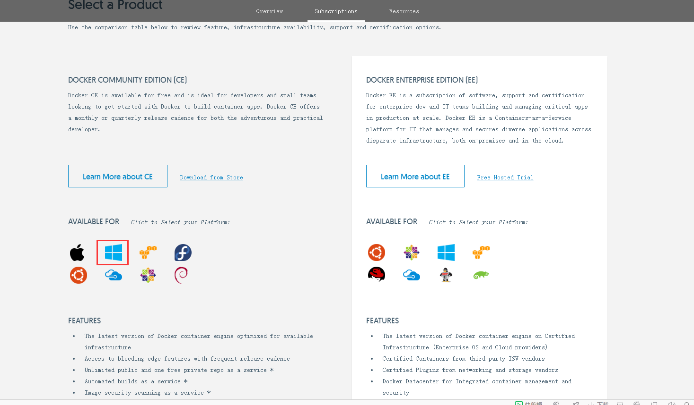
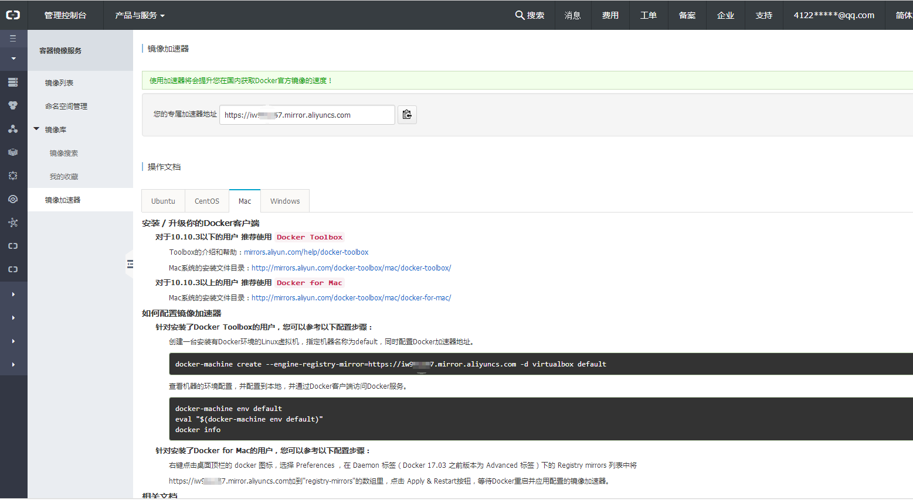

&emsp;&emsp;Docker 是一个开源的应用容器引擎，让开发者可以打包他们的应用以及依赖包到一个可移植的容器中，然后发布到任何流行的Linux机器上，也可以实现虚拟化，容器是完全使用沙箱机制，相互之间不会有任何接口。

### Docker 包括三个基本概念
理解了这三个概念，就理解了 Docker 的整个生命周期。
- 镜像 (Image)&emsp;&emsp;&emsp;&emsp;&emsp;#Docker 镜像是用于创建 Docker 容器的模板。
- 容器 (Container)&emsp;&emsp;&emsp;#容器是独立运行的一个或一组应用。
- 仓库 (Repository)&emsp;&emsp;&emsp;#Docker 仓库用来保存镜像，可以理解为代码控制中的代码仓库(类似git)。

镜像:一个镜像可以包含一个完整的 ubuntu 操作系统环境。系统中可以安装各种软件。 

容器:从镜像创建的运行。它可以被启动、开始、停止、删除。每个容器都是相互隔离的、保证安全的平台。 

仓库:仓库是集中存放镜像文件的地方。最大的公开仓库是 [Docker Hub](https://hub.docker.com/)，存放了数量庞大的镜像供用户下载。 国内的公开仓库包括 [阿里云 docker](https://dev.aliyun.com/list.html) 等，可以提供更稳定快速的访问。 

### Docker安装
[Docker官网](https://www.docker.com/get-docker) 提供了各种平台的安装包以及安装步骤(支持windows、mac)。下载社区版(CE)进行安装。
Docker 社区版（CE）是开发人员和小型团队试用 Docker 和容器应用的理想之选。Docker CE 适用于许多主流的基础设施平台，如桌面、云和开源操作系统，Docker CE 提供了简单快速的安装程序，安装后即可立即着手应用开发。Docker CE 根据基础设施进行了集成和优化，因此在使用 Docker 时能够保持本机应用一般的流畅使用体验。有了 Docker 社区版，您可以构建自己的第一个容器，并与团队伙伴共享，还能自动化开发流程。

 

### Docker镜像加速器
在不同的系统下面，配置加速器的方式有一些不同。本文使用  [阿里云 docker](https://dev.aliyun.com/list.html) 提供的加速配置。
打开阿里云 管理控制台 > 产品与服务 > 容器镜像服务。获取镜像加速器配置。

 

### 获取镜像
Docker容器运行前需要获取对应的镜像。如果本地镜像不存在，Docker会从镜像仓库下载（默认是 Docker Hub 仓库中下载）。

使用 `docker pull` 命令来从仓库获取所需要的镜像。

从docker镜像仓库中下载ubuntu操作系统镜像。如果不指定具体的标记，则默认使用 latest 标记信息。
```
iMac:~ yinxinwei$ docker pull ubuntu:latest
latest: Pulling from library/ubuntu
8f7c85c2269a: Downloading [==>                                                ]  2.207MB/42.84MB
9e72e494a6dd: Download complete 
3009ec50c887: Download complete 
9d5ffccbec91: Download complete 
e872a2642ce1: Download complete 
```
该命令相当于 `docker pull registry.hub.docker.com/ubuntu:latest`。即从注册服务器 `registry.hub.docker.com` 中的 ubuntu 仓库来下载标最新的镜像。
不设置镜像加速器下载会很慢。如果没设置镜像加速器可以使用国内镜像仓库下载。

### 查看本机所有镜像
使用 `docker images` 列出本地所有镜像。
```
iMac:~ yinxinwei$ docker images
REPOSITORY                                       TAG                 IMAGE ID            CREATED             SIZE
ubuntu                                           latest              2a4cca5ac898        6 days ago          111MB
registry.cn-hangzhou.aliyuncs.com/moojnn/mysql   v7.3.1.3            ea275fffa929        4 months ago        390MB
```
列出了镜像的详细信息。
- `REPOSITORY` 可以看出镜像来源
- `TAG` 镜像的标记
- `IMAGE ID` 镜像ID（同一来源 不同版本的镜像ID一样）
- `CREATED` 创建具体时间
- `SIZE` 镜像大小

### Dockerfile创建镜像
以交互方式运行我们本地ubuntu容器， 尝试使用vim命令.

```
iMac:~ yinxinwei$ docker run -it ubuntu:latest /bin/bash
root@778f824a9c9d:/# sshd   
bash: sshd: command not found
root@778f824a9c9d:/# 
bash: vim: command not found
root@778f824a9c9d:/# 
```
会发现容器中没有安装该服务。

创建Dockerfile
```
$ mkdir ubuntu_vim
$ touch Dockerfile
$ mkdir ubuntu_vim
$ cd ubuntu_vim/
$ touch Dockerfile
```
编辑Dockerfile
```
# ubuntu中安装vim
FROM ubuntu:latest
MAINTAINER sophieb <motherlovefather@126.com>
RUN apt-get -y update && apt-get install -y vim
```
Dockerfile基本语法
- `#` 标识来注释
- `FROM` 表示 Docker 使用哪个镜像作为基础
- `MAINTAINER` 用户信息
- `RUN` 表示会在创建镜像中运行，比如安装一个软件包，在这里使用 apt-get 来安装 vim 
- `ADD` 命令复制本地文件到镜像
- `EXPOSE` 命令来向外部开放端口
- `CMD` 命令来描述容器启动后运行的程序

编写完成 Dockerfile 后，可以使用 `docker build` 来生成镜像。
```
$ docker build -t ubuntu_vim:v1 .
Sending build context to Docker daemon  2.048kB
Step 1/3 : FROM ubuntu:latest
 ---> 2a4cca5ac898
Step 2/3 : MAINTAINER sophieb <motherlovefather@126.com>
 ---> Running in 332188c74e54
Removing intermediate container 332188c74e54
 ---> aa7517a6be99
Step 3/3 : RUN apt-get -y update && apt-get install -y vim
 ---> Running in 532f2f0ac2fe
...
Processing triggers for libc-bin (2.23-0ubuntu9) ...
Removing intermediate container 532f2f0ac2fe
 ---> 8f7776757b7c
Successfully built 8f7776757b7c
Successfully tagged ubuntu_vim:v1
```
其中 `-t` 标记来添加 `tag`，指定新的镜像的信息。 “.” 是 Dockerfile 所在的路径（当前目录），也可以替换为一个具体的 Dockerfile 的路径。

用 `docker images` 查看镜像
```
$ docker images
REPOSITORY                                       TAG                 IMAGE ID            CREATED             SIZE
ubuntu_vim                                       v1                  8f7776757b7c        9 minutes ago       209MB
ubuntu                                           latest              2a4cca5ac898        6 days ago          111MB
```

利用新创建的镜像来启动一个容器
```
$ docker run -it 8f7776757b7c /bin/bash
或者
$ docker run -it ubuntu_vim:v1 /bin/bash
```

查看vim版本信息
```
vim --version
VIM - Vi IMproved 7.4 (2013 Aug 10, compiled Nov 24 2016 16:44:48)
Included patches: 1-1689
Extra patches: 8.0.0056
Modified by pkg-vim-maintainers@lists.alioth.debian.org
Compiled by pkg-vim-maintainers@lists.alioth.debian.org
Huge version without GUI.  Features included (+) or not (-):
```

可以用 docker tag 命令来修改镜像的标签。
```
$ docker tag 8f7776757b7c ubuntu_v:dev
$ docker images
REPOSITORY                                       TAG                 IMAGE ID            CREATED             SIZE
ubuntu_v                                         dev                 8f7776757b7c        23 minutes ago      209MB
ubuntu_vim                                       v1                  8f7776757b7c        23 minutes ago      209MB
ubuntu                                           latest              2a4cca5ac898        6 days ago          111MB
```

### 导出和载入镜像

导出镜像到本地文件，可以使用 `docker save` 命令
```
$ docker save -o ubuntu_vim_local.tar ubuntu_vim:v1
```
-o :输出到的文件。

导入到本地镜像库，可以使用 `docker load` 命令

```
$ docker load < ubuntu_vim_local.tar
或
$ docker load --input ubuntu_vim_local.tar
```

我们也可以使用 `docker export` 和 `docker import` 导出和载入。
注：
`docker save images_name`：将镜像导出为文件，再使用`docker load`命令将文件导入为一个镜像，会保存该镜像的的所有历史记录。比`docker export`命令导出的文件大，很好理解，因为会保存镜像的所有历史记录。 

`docker export container_id`：将容器导出为文件，再使用`docker import`命令将容器导入成为一个新的镜像，但是相比`docker save`命令，容器文件会丢失所有元数据和历史记录，仅保存容器当时的状态，相当于虚拟机快照。

### 上传镜像

以通过 `docker push` 命令，把自己创建的镜像上传到仓库中来共享。
```
$ docker tag 8f7776757b7c registry.cn-hangzhou.aliyuncs.com/sophieb/ubuntu:v1
$ docker push registry.cn-hangzhou.aliyuncs.com/sophieb/ubuntu:v1
```

### 移除镜像
移除本地的镜像，可以使用 `docker rmi `命令。
```
$ docker rmi ubuntu_vim:v1
```
注意 `docker rm` 命令是移除容器。

