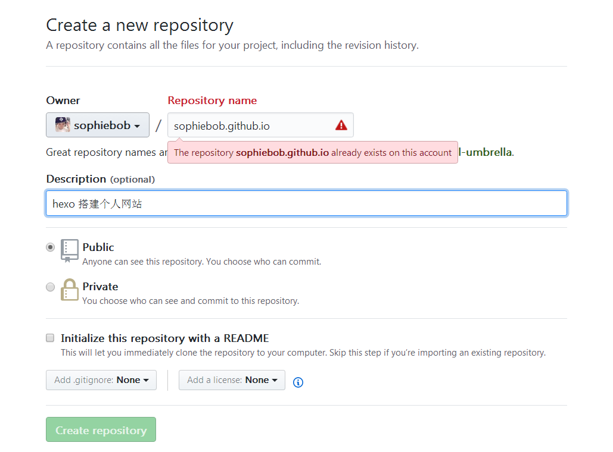
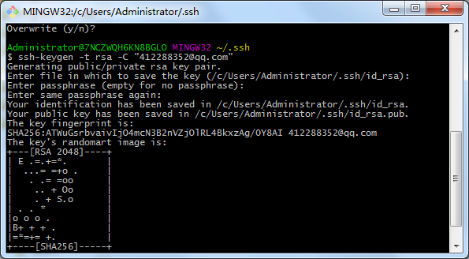
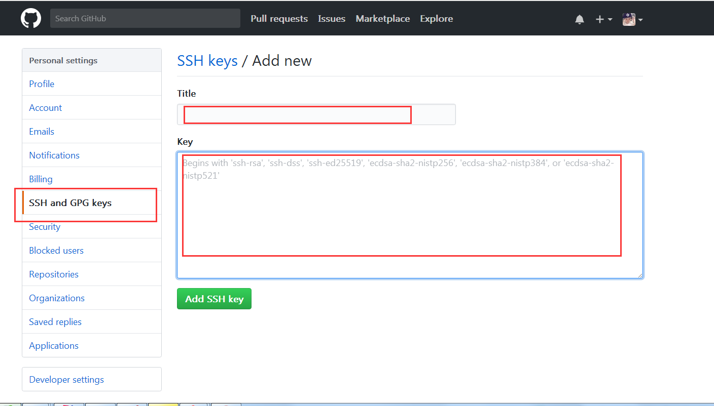

### 创建Github账号
如果没有账号可以访问[Github](https://github.com/)官网进行注册。

### 创建与账号同名的Repository
点击页面右上角 `New repository` 创建一个repository。
在Repository name中填写你的Github账号名.github.io，我这里是sophiebob.github.io。
 
点击`Create repository`，完成创建。

### 创建SSH Key
打开`git bash`,检查是否已经生成`SSH Key`
```
$ cd ~/.ssh
```
如果不存在，则新建一个新的SSH(或者删除,重新创建)
```
$ ssh-keygen -t rsa -C "e-mail"
```
`e-mail`是注册时使用的Github邮箱。然后一直按回车键。最后生成SSH文件
 

### 复制公钥内容到Github账户
打开 `~/.ssh/id_rsa.pub` 文件，记事本打开并复制里面的内容（windows目录：C:\Users\Administrator\\.ssh）。打开github主页。点击头像个人设置 -> SSH and GPG keys -> New SSH key
 

### 测试SSH是否配置成功
```
$ ssh -T git@github.com # 注意邮箱地址不要改
```
如果显示如下提示，则说明配置成功。
> Hi sophiebob/sophiebob.github.io! You've successfully authenticated, but GitHub does not provide shell access.

### 配置站点配置文件_config.yml
打开<font size=3 color=#D2691E>站点配置文件</font>,添加如下
```
 # Deployment
  ## Docs: https://hexo.io/docs/deployment.html
  deploy:
    type: git
    repository: git@github.com:sophiebob/sophiebob.github.io.git
    branch: master
```
注意`:`后面要加上空格。 `sophiebob/sophiebob.github.io.git` 换成你上面配置的repository。

### github上部署
```
$ hexo clean
$ hexo g
$ hexo d
或者
$ hexo g -d
```
打开 http://sophiebob.github.io 就可以看到您博客的主页。
