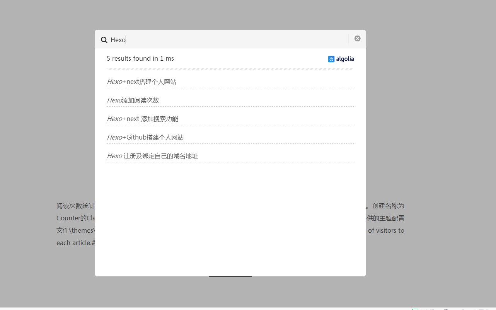
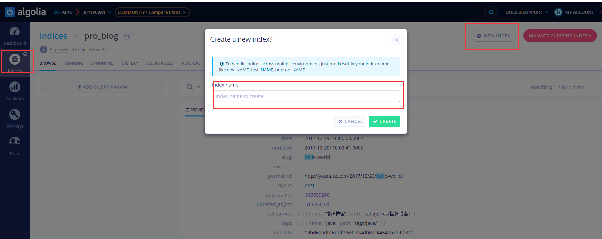
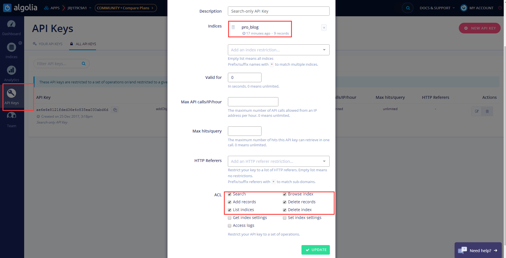

Algolia是一家为网站与移动应用提供托管式搜索API的初创企业，成立于2012年，总部位于旧金山，曾参加过去年的YC训练营。网站或移动应用只需嵌入简单代码数分钟即可实现搜索功能。

实现的效果如下

 

### 注册Algolia
打开[Algolia](https://www.algolia.com/)进行注册。可直接使用github账号进行注册。

### 创建index
点击 `NEW INDEX`创建一个新的index。`Index Name` 后面会使用到。如图所示：
 

### 编辑KEY
点击侧边栏`API Keys`可以看到 `Application ID`、 `Search-Only API Key` 、 `Admin API Key`。后面我们需要用到。 点击 `ALL API KEYS`，编辑KEY。如图所示。
 

### 安装hexo-algoliasearch插件
在Hexo的根目录下执行
```
$ npm install hexo-algoliasearch --save 
```

### 配置站点信息
打开 <font size=3 color=#D2691E>站点配置文件</font>，添加algolia配置信息。
```
algolia:
  applicationID: 
  apiKey: 
  adminApiKey: 
  indexName: #创建index使用的Index Name
  chunkSize: 5000
```
打开 <font size=3 color=#D2691E>主题配置文件</font>，添加algolia配置信息。
```
# Algolia Search
algolia_search:
  enable: true
  hits:
    per_page: 10
  labels:
    input_placeholder: Search for Posts
    hits_empty: "We didn't find any results for the search: ${query}"
    hits_stats: "${hits} results found in ${time} ms"
```

在环境变量中添加 `HEXO_ALGOLIA_INDEXING_KEY`， 在Hexo的根目录执行
```
$ export HEXO_ALGOLIA_INDEXING_KEY=粘贴上一步复制的 API KEY
```
再次执行
```
$ hexo clean
$ hexo algolia
```
至此，我们的工作就完成了。


