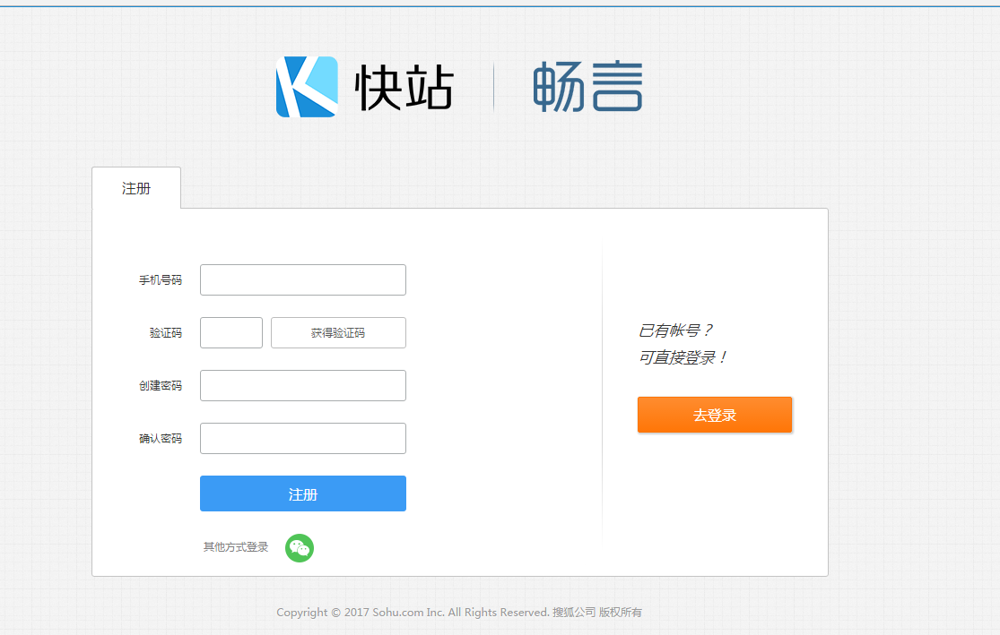
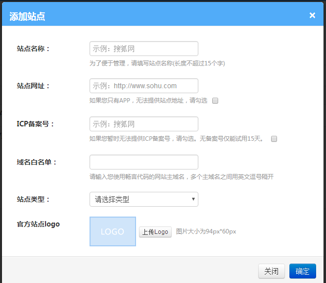

畅言是一个简单而强大的社会化评论及聚合平台。用户可以直接用自己的社会化网络账户在第三方网站发表评论,并且一键评论同步至社交网络将网站内容和自己的评论分享。

### 注册畅言评论
打开[畅言评论](http://changyan.kuaizhan.com/) 进行注册。如图所示：

 

### 添加站点信息。
 

站点信息成功添加后，等待审核。审核过了可以重新编辑站点信息。这应该算是添加站点信息的BUG。

### 获取KEY
点击 `后台总览` 获取 `APP ID`、`APP KEY`。

### 修改配置文件
在主题themes目录下有第三方提供的主题配置文件\themes\next\_config.yml。我们称之为<font size=3 color=#D2691E>主题配置文件</font>。
打开<font size=3 color=#D2691E>主题配置文件</font> 添加key
```
# changyan
changyan:
  enable: true
  appid: 
  appkey: 
```
再次执行
```
$ hexo clean
$ hexo g -d
```
至此，Hexo基本功能都已实现。
