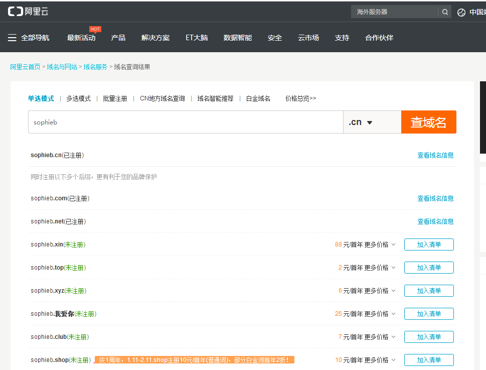
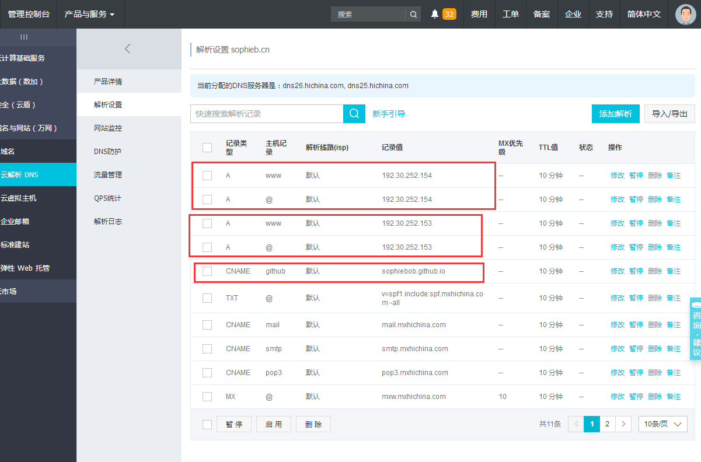
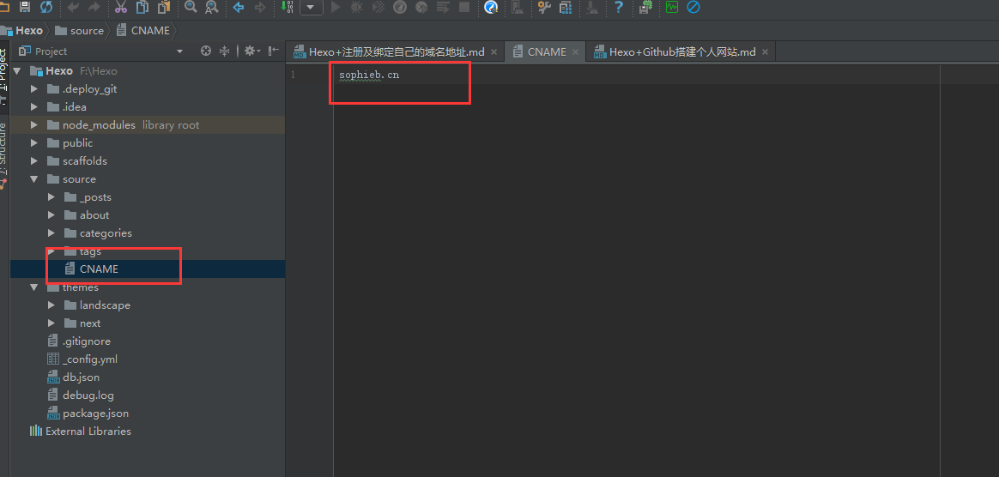

### 域名注册
推荐选择国内的[万网(阿里云)](https://wanwang.aliyun.com/)进行域名的注册。`.cn` 一年才几十块。`.site`更便宜。

### DNS域名解析设置

注册或登录[万网(阿里云)](https://wanwang.aliyun.com/)购买域名。进入阿里云首页 > 域名与网站 > 域名服务 > 
查询未注册域名，然后购买。`sophieb.cn`已经被我注册了。

 

购买后进如 `云解析 DNS`添加解析规则。如图所示

 
点击添加解析，记录类型选A或CNAME，A记录的记录值就是ip地址。
github(官方文档)提供了两个IP地址，192.30.252.153和192.30.252.154，这两个IP地址为github的服务器地址，两个都要填上。

### 创建CNAME文件
在hexo根目录的source文件夹里创建CNAME文件，不带任何后缀。打开文件添加你的域名信息。如：sophieb.cn

 

### 重新部署
> $ hexo g -d 

此时你使用 `sophieb.cn` 或者 `www.sophieb.cn` 都可以访问你的博客。