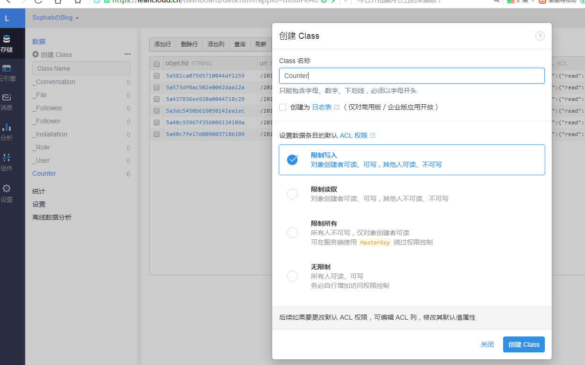
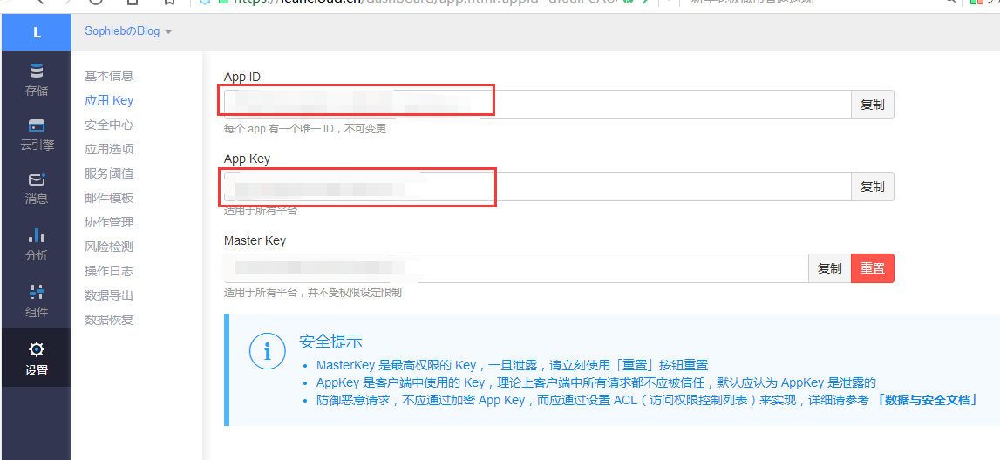

### 阅读次数统计
[`next`](https://github.com/iissnan/hexo-theme-next) 也集成了 [`leancloud`](https://leancloud.cn/) 。可以在[leancloud](https://leancloud.cn/)进行账号注册。
创建一个新的应用。点击应用进入。
创建名称为Counter的Class。
 

点击设置 > 应用Key 复制`App ID` 和 `App Key`

 

### 修改配置文件
在主题themes目录下有第三方提供的主题配置文件\themes\next\_config.yml。我们称之为<font size=3 color=#D2691E>主题配置文件</font>。
打开<font size=3 color=#D2691E>主题配置文件</font> 添加key
```
 # Show number of visitors to each article.
 # You can visit https://leancloud.cn get AppID and AppKey.
  leancloud_visitors:
    enable: true
    app_id: 
    app_key: 
```
### 修改统计设置
打开<font size=3 color=#D2691E>主题配置文件</font> 定位到 `post_wordcount`
```
# Post wordcount display settings
# Dependencies: https://github.com/willin/hexo-wordcount
post_wordcount:
  item_text: true
  wordcount: true
  min2read: true
  totalcount: false
  separated_meta: true
```
### Web安全性
为了保证应用的统计计数功能仅应用于自己的博客，你可以在应用 > 设置 > 安全中心的Web安全域名中加入自己的博客域名，保证数据的调用安全。