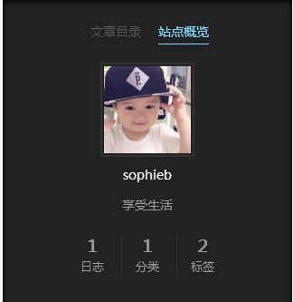
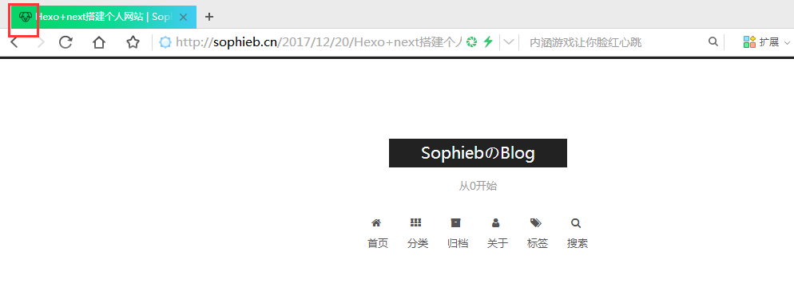
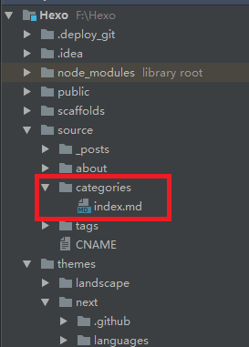

### 安装前提
安装 Hexo 非常简单。首先您必须安装下列软件：

> [Git](https://git-scm.com/)  
> [Node.js](https://nodejs.org/en/)  

### 安装Hexo

安装Node.js后,我们可以使用npm安装Hexo。
```
$ npm install -g hexo
```
安装Hexo后,首先需要创建一个文件夹(F:\Hexo),在指定文件夹中执行下列命令(Hexo文件夹上右键，选择`git bash`), Hexo 将会在文件夹中创建所需文件。
```
$ hexo init
```
等待安装,安装后可以看到许多文件。继续执行命令
```
$ hexo g
$ hexo s
```
这个时候，我们在浏览器中访问 http://localhost:4000/ ，就可以看到基于 Hexo 的默认主题的原型。

### hexo常用命令

> $ hexo g #完整命令为hexo generate,用于生成静态文件  
> $ hexo s #完整命令为hexo server,启动本地服务器  
> $ hexo d #完整命令为hexo deploy,用于文件发布到github上  
> $ hexo n #完整命令为hexo new,用于新建一篇文章

### 安装 [next](https://github.com/iissnan/hexo-theme-next) 主题
```
$ git clone https://github.com/iissnan/hexo-theme-next themes/next
```
也可以直接到[next](https://github.com/iissnan/hexo-theme-next)上直接下载，放到theme目录下。

`ps:`  
在 Hexo 中主要配置文件，其名为 _config.yml。我们称之为<font size=3 color=#D2691E>站点配置文件</font>。  
在主题themes目录下有第三方提供的主题配置文件\themes\next\_config.yml。我们称之为<font size=3 color=#D2691E>主题配置文件</font>。
### 使用 next 主题  
打开 <font size=3 color=#D2691E>站点配置文件</font>，找到 `theme` 字段，将其值更改为 `next`。
```
theme: next  #冒号后有空格#
```
### 预览next主题
执行命令
```
$ hexo g
$ hexo s
```
这个时候，我们在浏览器中访问 http://localhost:4000/ ，就可以看到基于 Hexo 的 next 主题的原型。  
在<font size=3 color=#D2691E>主题配置文件</font>中找到 `scheme` 关键字 可以修改样式。  
目前 NexT 支持四种 Scheme，他们是：
> Muse  
> Mist  
> Pisces  
> Gemini

打开<font size=3 color=#D2691E>站点配置文件</font>,配置语言和站点信息：
```
# Site
title: SophiebのBlog
subtitle: 从0开始
description: 享受生活
author: sophieb
language: zh-Hans
timezone: Asia/Shanghai #配置中文
```
更多详情查看[`next文档`](https://github.com/iissnan/hexo-theme-next)

### 定制侧边栏头像
打开<font size=3 color=#D2691E>主题配置文件</font>_config.yml，查找 `avatar`修改其值（添加字段）
```
avatar: /uploads/avatar.jpg 需要将你的头像图片放置在 站点的 source/uploads/（新建uploads目录）
或
avatar: /images/avatar.jpg
```
修改后本地部署预览

 

### 设置favicon图标
1.首先准备16X16和32X32大小的图片。可以去[Easyicon](http://www.easyicon.net/)上挑选。  
2.在<font size=3 color=#D2691E>主题配置文件</font>_config.yml，查找 `favicon` 修改配置文件
```
favicon:
  small: /images/favicon-16x16.png #替换此处的图片# 
  medium: /images/favicon-32x32.png  #替换此处的图片# 
  apple_touch_icon: /images/apple-touch-icon-next.png
  safari_pinned_tab: /images/logo.svg
```
3.重新部署即可。

 

### 创建 `分类`、`归档`、`关于`
1.在<font size=3 color=#D2691E>主题配置文件</font>_config.yml，查找 `menu` 修改配置文件  
```
menu:
  home: / || home
  categories: /categories/ || th
  archives: /archives/ || archive
  about: /about/ || user
  tags: /tags/ || tags
```
2.设置`分类` 新建一个页面，命名为categories
```
$ hexo new page categories
```
3.在Hexo/source目录下会生成categories目录

 

4.编辑categories文件夹下的index.md
```
title: categories
date: 2017-12-20 18:04:55
type: "categories"
comments: false
```

5.同理设置`标签`
```
title: categories
date: 2017-12-20 18:04:55
type: "categories"
comments: false
```

### 新建文章
```
$ hexo new  Hexo+next搭建个人网站
```
会在Hexo/source/_posts中创建 `Hexo+next搭建个人网站` 目录。打开目录下`Hexo+next搭建个人网站.md`文件添加类别和标签

```
title: Hexo+next搭建个人网站
date: 2017-12-20
tags: [hexo,next]  #多个标签用`,`分开
categories: 搭建博客
```
也可以在Hexo/source/_posts目录下手动创建文件夹和文件。

### 总结
#### 本地部署
```
$ hexo clean
$ hexo g
$ hexo s --debug
```
加上debug运行，如果运行出错可以在命令行中查看错误提示。

#### github上部署
```
$ hexo clean
$ hexo g
$ hexo d
```
部署前我们需要配置好deploy文件。后面会介绍。